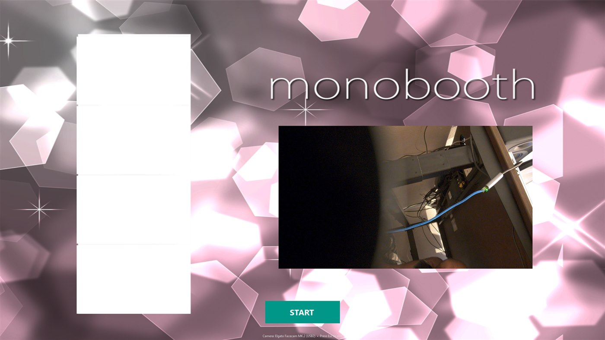

# MonoBooth 📸

**A free, do-it-yourself photo booth for your wedding, party, or event.** Run it on any Windows
laptop or mini-PC with a webcam, hit **START**, and your guests get a classic 2×6 photo strip — the
same kind you'd pay a rental company hundreds of dollars for.



---

## What your guests get

- A big, friendly **full-screen booth** with a live preview so people can see themselves.
- A **"3 · 2 · 1 · Smile!"** countdown before each of **four photos**.
- A printed **2×6 photo strip** — and with a photo printer that cuts, **two copies** so everyone
  gets one.
- Every photo and strip is also **saved to your computer** (in `Pictures\MonoBooth`) as a keepsake.

## Get started in 5 minutes

1. **Download** the latest `MonoBooth-Setup.exe` from the
   [**Releases page**](https://github.com/dave92082/monobooth/releases).
2. **Run the installer.** It adds MonoBooth to your Start menu (and the desktop, if you like).
   Nothing else to install.
3. **Plug in your webcam** — and your photo printer, if you have one.
4. **Turn on camera access:** open Windows **Settings → Privacy & security → Camera**, and switch
   **"Let desktop apps access your camera"** to **On**. *(If this is off, MonoBooth says "No camera
   found.")*
5. **Open MonoBooth, press START, and smile!** Press **Esc** when you're done to close the booth.

> 💡 **Tip:** Set the booth PC to never sleep, and put MonoBooth's shortcut in your Startup folder so
> it launches on its own — then the laptop is ready the moment you open it.

## Printing the strips

MonoBooth prints a **2×6 strip** and asks the printer for **2 copies** by default — perfect for a
dye-sub photo printer like the **Kodak 6850** loaded with 2×6 media, which prints *and cuts* each
strip automatically. No photo printer? No problem — MonoBooth simply skips printing and still saves
every photo to your computer.

You can change how many copies print (or turn printing off) in **Settings** below.

## Make it yours

Add your own background art — the couple's names, an event logo, a fun frame — and the booth becomes
*your* booth:

1. Save your picture somewhere (a full-screen image works best).
2. Point `BackgroundImagePath` at it in the settings file (see below).
3. Open MonoBooth and **right-click-drag** the live preview or the photo strip to sit them nicely on
   your artwork. Your arrangement is **saved automatically** when you exit.

The booth ships with the pink design shown above, ready to use out of the box.

## Settings

MonoBooth keeps its options in a small text file you can edit:

```
%LOCALAPPDATA%\MonoBooth\settings.json
```

*(Paste that path into the File Explorer address bar to find it.)* Change a value, save the file, and
reopen MonoBooth.

| Setting | Default | What it does |
| --- | --- | --- |
| `FrameCount` | `4` | How many photos make up a strip. |
| `CountdownSeconds` | `3` | Length of the countdown before each photo. |
| `PrintEnabled` | `true` | Whether to print the strip. Set to `false` to only save photos. |
| `PrintCopies` | `2` | How many strips the printer makes each time. |
| `BackgroundImagePath` | `""` | Your own background image. Leave empty to use the built-in one. |
| `OutputDirectory` | `"{Pictures}/MonoBooth"` | Where photos are saved. |
| `PreferredCamera` | `""` | If you have more than one camera, part of its name (e.g. `"Logitech"`). |
| `BorderColor` | `"Black"` | Colour of the border around each photo. |

To start over with the defaults, just delete `settings.json` and reopen MonoBooth.

## Troubleshooting

| Problem | Fix |
| --- | --- |
| **"No camera found"** | Plug the webcam in, then turn on *Settings → Privacy & security → Camera → Let desktop apps access your camera*. |
| **Preview is black** | Close any other app using the camera (Zoom, Teams, the Camera app) and reopen MonoBooth. |
| **Nothing prints** | Make sure the printer is set as your **default** printer and loaded with paper. MonoBooth keeps running even with no printer. |
| **Strip or preview is off-screen** | Right-drag it back into view, or delete `settings.json` to reset positions. |

## Requirements

- A **Windows 10 or 11** computer (most laptops from the last several years work great).
- A **webcam** — built-in or USB.
- *Optional:* a **photo printer** (a 2×6-capable dye-sub like the Kodak 6850 gives the real
  photo-booth experience).

---

🛠️ **Want to build it yourself or contribute?** See [docs/DEVELOPING.md](docs/DEVELOPING.md).

MonoBooth was first built in 2011 for a wedding and rebuilt in 2026 on modern .NET. It's free to use.
